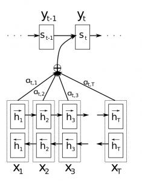
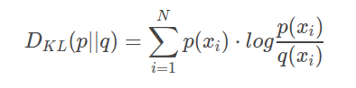

### 已读论文博客

* EDA: Easy Data Augmentation Techniques for Boosting Performance on Text Classification Tasks.[`论文`](https://arxiv.org/pdf/1901.11196.pdf)

> 跟图像一样, 希望采用数据变换的方式来增强文本分类的鲁棒性.\
> 同义词:随机替换, 随机插入, 随机交换位置, 随机删除

* Attention-based-model. [`博客`](http://www.wildml.com/2016/01/attention-and-memory-in-deep-learning-and-nlp/), [`survey`](http://yanran.li/peppypapers/2015/10/07/survey-attention-model-1.html)

* Transformer.[`博客`](https://jalammar.github.io/illustrated-transformer/) [`论文`](https://arxiv.org/pdf/1706.03762.pdf)
* Transformer-XL. [`论文`](https://arxiv.org/pdf/1901.02860.pdf)
* KL divergence. [`博客`](https://www.countbayesie.com/blog/2017/5/9/kullback-leibler-divergence-explained)

* SeqGAN: Sequence Generative Adversarial Nets with Policy Gradient. [`论文`](https://arxiv.org/pdf/1609.05473.pdf)
* Convolutional Neural Networks for Sentence Classification. [`论文`](https://arxiv.org/pdf/1408.5882.pdf)
* Attention-Based Bidirectional Long Short-Term Memory Networks for Relation Classification. [`论文`](http://www.aclweb.org/anthology/P16-2034)
* A Question-Focused Multi-Factor Attention Network for Question Answering. [`论文`](https://arxiv.org/pdf/1801.08290.pdf)
* Building Autoencoders in Keras. [`博客`](https://blog.keras.io/building-autoencoders-in-keras.html)
* Modern Deep Learning Techniques Applied to Natural Language Processing. [`博客`](https://nlpoverview.com/)
* node2vec. [`博客`](https://towardsdatascience.com/node2vec-embeddings-for-graph-data-32a866340fef)

### 待深入

* GloVe. [`论文`](https://nlp.stanford.edu/pubs/glove.pdf) [`官网`](https://nlp.stanford.edu/projects/glove/) [`博客`](https://blog.csdn.net/u014665013/article/details/79642083)
* A Deep Ensemble Model with Slot Alignment for Sequence-to-Sequence Natural Language Generation. [`论文`](https://arxiv.org/pdf/1805.06553.pdf)
* The Design and Implementation of XiaoIce, an Empathetic Social Chatbot. [`论文`](https://arxiv.org/pdf/1812.08989.pdf)
* A Knowledge-Grounded Neural Conversation Model. [`论文`](https://arxiv.org/pdf/1702.01932.pdf)
* Neural Generative Question Answering. [`论文`](https://arxiv.org/pdf/1512.01337v1.pdf)
* A Sensitivity Analysis of (and Practitioners’ Guide to) Convolutional Neural Networks for Sentence Classification. [`论文`](https://arxiv.org/pdf/1510.03820.pdf)
* ImageNet Classification with Deep Convolutional Neural Networks. [`2012`](http://120.52.51.17/www.cs.toronto.edu/~fritz/absps/imagenet.pdf)
* Network In Network. [`2013`](https://arxiv.org/pdf/1312.4400.pdf),[`翻译`](https://www.jianshu.com/p/8a3f9f06bbe3)
* LSTM. [`论文`](http://www.bioinf.jku.at/publications/older/2604.pdf)
* GRU. [`论文`](https://arxiv.org/pdf/1406.1078v3.pdf)
* Get To The Point: Summarization with Pointer-Generator Networks. [`论文`](https://arxiv.org/pdf/1704.04368.pdf)
* Generative Adversarial Text to Image Synthesis. [`论文`](https://arxiv.org/pdf/1605.05396.pdf)
* Image-to-Image Translation with Conditional Adversarial Networks. [`论文`](https://arxiv.org/pdf/1611.07004.pdf)
* Photo-Realistic Single Image Super-Resolution Using a Generative Adversarial Network. [`论文`](https://arxiv.org/pdf/1609.04802.pdf)
* Unsupervised Learning of Visual Structure using Predictive Generative Networks. [`论文`](https://arxiv.org/pdf/1511.06380.pdf)
* Learning to Rank Short Text Pairs with Convolutional Deep Neural Networks. [`论文`](http://citeseerx.ist.psu.edu/viewdoc/download?doi=10.1.1.723.6492&rep=rep1&type=pdf)
* GAN Dissection: Visualizing and Understanding Generative Adversarial Networks. [`博客`](https://gandissect.csail.mit.edu/?utm_campaign=the_algorithm.unpaid.engagement&utm_source=hs_email&utm_medium=email&_hsenc=p2ANqtz-8kxzmyRmbG-8kGLZmbD-jZcUEpJidf6MnVsJOK62S0aVm88ioDTuQC2FPFAnkZQDBiqBw7)
* wildml. [`博客`](http://www.wildml.com/)
* Keras. [`博客`](https://www.pyimagesearch.com/2018/09/10/keras-tutorial-how-to-get-started-with-keras-deep-learning-and-python/)
* [A Neural Network](https://iamtrask.github.io/2015/07/27/python-network-part2/)

### NLP方面的博客

[莫坠青云志](https://tobiaslee.top/)

[Bert解读](https://www.cnblogs.com/rucwxb/p/10277217.html)

[pytorch-tutorials](https://pytorch.org/tutorials/)

bert分类. [`博客1`](https://www.jiqizhixin.com/articles/2019-03-13-4), [`博客2`](https://www.cnblogs.com/jiangxinyang/p/10241243.html), [`博客3`](https://blog.csdn.net/macanv/article/details/85684284), [`博客4`](http://www.52nlp.cn/bert-paper-%E8%AE%BA%E6%96%87-%E6%96%87%E7%AB%A0-%E4%BB%A3%E7%A0%81%E8%B5%84%E6%BA%90%E6%B1%87%E6%80%BB)

[彗双智能-Keras源码分析](http://wangbn.blogspot.com/)

### 相关会议

[ACL](https://www.aclweb.org/portal/)

 > The Association for Computational Linguistics, NLP最权威的国际专业学会
 
[NIPS](https://nips.cc/)
 
 > Conference and Workshop on Neural Information Processing Systems, 神经信息处理系统大会, 是一个关于机器学习和计算神经科学的国际会议
 
[CICLing](https://www.cicling.org/2018/)

> International Conference on Intelligent Text Processing and Computational Linguistics

[PACLIC](http://www.cbs.polyu.edu.hk/2018paclic/)
 
> Pacific Asia Conference on Language, Information, and Computation

[UAI](http://auai.org/)
 
[AAAI](https://www.aaai.org/)

[IJCAI](https://www.ijcai.org/)

[ICML](https://icml.cc/)