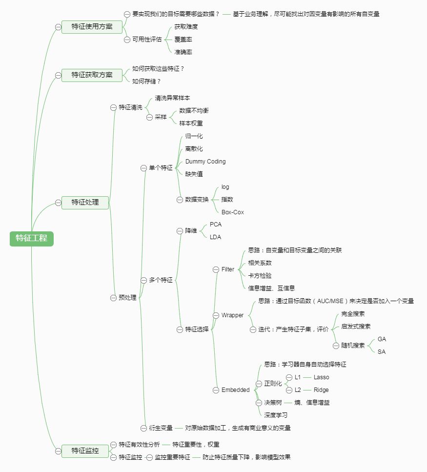

# 基础知识

> 涉及一些基础知识的总结与整理

## 机器学习

机器学习算法是一种能够从数据中学习的算法。Mitchell(1997)定义机器学习：“对于某类任务`T`和性能度量`P`，一个计算机程序被认为可以从经验`E`中学习是指通过经验`E`改进后，它在任务`T`上由性能度量`P`衡量的性能有所提升。” 

机器学习的主要挑战是我们的算法必须能够在先前未观测的新输入上表现良好，而不只是在训练集上表现良好。在先前未观测到的输入上表现良好的能力被称为 泛化（generalization）。

以下是决定机器学习算法效果是否好的因素：

1. 降低训练误差。
2. 缩小训练误差和测试误差的差距。

对应机器学习的两个主要挑战： 欠拟合（underfitting）和 过拟合（overfitting）。

## 预训练

我们在训练模型的时候，如果训练数据比较少，则会导致训练的模型参数不够好；这时候，如果有一批其它的大量的训练数据，我们可用这批大量的数据训练一个网络，学会网络参数，然后用相同的网络结构，参数初始化时加载训练好的参数，在高层的参数随机初始化，用少量的数据集进行训练。加载的训练好的参数可以保持不变，即“frozen“，也可以随着训练的进行改变，即”fine_tuning“，最常见的例子用在图像处理中。

优点：加快训练速度；解决数据集太小导致的无法训练问题；找到好的初始化参数。

# 参考内容

* [使用sklearn做单机特征工程](https://www.cnblogs.com/jasonfreak/p/5448385.html)

