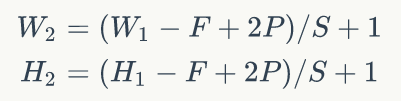

### 1. 使用cuda出现问题的解决方式

```bash
sudo ldconfig /usr/local/cuda-9.0/lib64
sudo ln -sf /usr/local/cuda-9.0/lib64/libcudnn.so.7.0.5 /usr/local/cuda-9.0/lib64/libcudnn.so.7
```

### 2. 找不到自己写的模块

**在代码入口处加入一下代码：**

```python
import sys
sys.path.append('/project_path/module')
```

### 3. CNN的feature map计算方式


