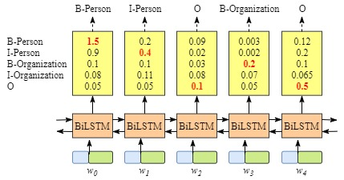
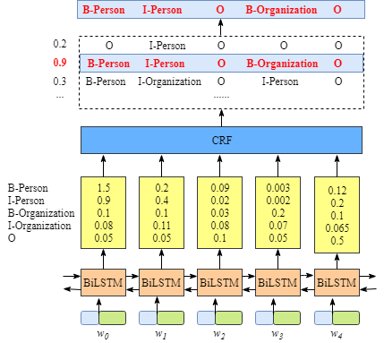

## ner模型

### 基于bi-lstm和crf的ner模型

代码来自[zh-NER-keras](https://github.com/stephen-v/zh-NER-keras)

[基于keras的BiLstm与CRF实现命名实体标注](https://www.cnblogs.com/vipyoumay/p/ner-chinese-keras.html)

> 单独LSTM预测出来的标注可能会出现`（I-Organization->I-Person,B-Organization ->I-Person）`这样的问题序列。\
> 但这种错误在CRF中是不存在的，因为CRF的特征函数的存在就是为了对输入序列观察、学习各种特征，这些特征就是在限定窗口size下的各种词之间的关系。

**没加CRF layer**

**添加了CRF layer**

